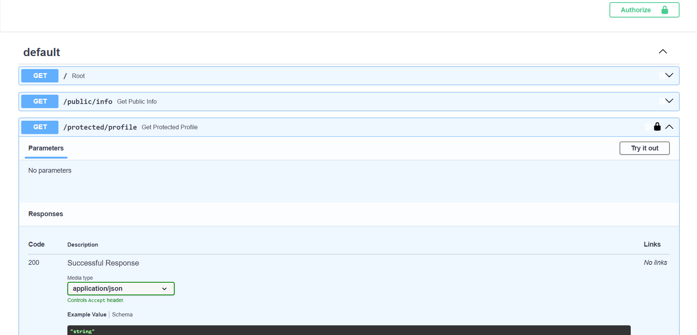

# Supabase Auth FastAPI Server

This project is a professional implementation of a REST API using **FastAPI** and **Supabase Auth**. It provides a secure way to handle user registration, authentication, and protected resource access using JWT (JSON Web Tokens).

## 🚀 Features

- **User Registration**: Secure signup via Supabase Auth.
- **JWT Authentication**: Login returns a Bearer token for secure access.
- **Protected Routes**: Middleware dependency that verifies JWTs against Supabase.
- **Swagger UI**: Integrated documentation with a built-in "Authorize" button for easy testing.

## 🛠️ Setup & Installation

### 1. Clone the repository

```bash
git clone <your-repo-url>
cd Week-4_A4
```

### 2. Install dependencies

```bash
pip install -r requirements.txt
```

### 3. Environment Variables

Create a `.env` file in the root directory by copying the example:

```bash
cp .env.example .env
```

Open `.env` and fill in your Supabase credentials:

- `SUPABASE_URL`: Your Supabase project URL.
- `SUPABASE_KEY`: Your Supabase anon/service role key.
- `PORT`: The port you want the server to run on (default: 8000).

## 🏃 Running the App

Start the server with a single command:

```bash
python main.py
```

The server will be available at `http://localhost:8000`.

## 📖 API Reference

| Endpoint               | Method | Auth Required | Description                               |
| :--------------------- | :----- | :-----------: | :---------------------------------------- |
| `/`                    | `GET`  |      ❌       | Health check to verify server connection  |
| `/public/info`         | `GET`  |      ❌       | Access public information                 |
| `/auth/signup`         | `POST` |      ❌       | Register a new user account               |
| `/auth/login`          | `POST` |      ❌       | Authenticate and receive a JWT token      |
| `/protected/profile`   | `GET`  |      ✅       | Retrieve the authenticated user's profile |
| `/protected/dashboard` | `GET`  |      ✅       | Access the user's private dashboard       |
| `/auth/logout`         | `POST` |      ✅       | Sign out of the current session           |

## 🧪 Testing with Swagger UI

1. Navigate to `http://localhost:8000/docs`.
2. Use the `/auth/login` endpoint to get your JWT.
3. Click the **Authorize** button at the top right.
4. Paste your token and click **Authorize**.
5. You can now test the protected endpoints directly from the browser.


